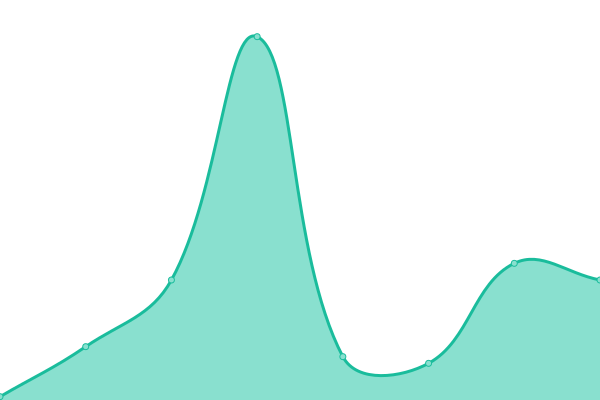

# [📈 Live Status](https://iscrdh.github.io/upptime): <!--live status--> **🟧 Partial outage**

This repository contains the open-source uptime monitor and status page for [iscrdh](https://iscrdh.github.io/upptime), powered by [Upptime](https://github.com/upptime/upptime).

With [Upptime](https://upptime.js.org), you can get your own unlimited and free uptime monitor and status page, powered entirely by a GitHub repository. We use [Issues](https://github.com/iscrdh/upptime/issues) as incident reports, [Actions](https://github.com/iscrdh/upptime/actions) as uptime monitors, and [Pages](https://iscrdh.github.io/upptime) for the status page.

<!--start: status pages-->
<!-- This summary is generated by Upptime (https://github.com/upptime/upptime) -->
<!-- Do not edit this manually, your changes will be overwritten -->
<!-- prettier-ignore -->
| URL | Status | History | Response Time | Uptime |
| --- | ------ | ------- | ------------- | ------ |
|  [Truyol](https://truyol.com/) | 🟩 Up | [truyol.yml](https://github.com/iscrdh/upptime/commits/HEAD/history/truyol.yml) | 

 1153ms
     
 | 

<a href="https://iscrdh.github.io/upptime/history/truyol">99.57%</a>
    

|  [Bo Truyol](https://bo.truyol.com/) | 🟩 Up | [bo-truyol.yml](https://github.com/iscrdh/upptime/commits/HEAD/history/bo-truyol.yml) | 

 903ms
     
 | 

<a href="https://iscrdh.github.io/upptime/history/bo-truyol">100.00%</a>
    

|  [Nroot](https://www.nroot.es/) | 🟩 Up | [nroot.yml](https://github.com/iscrdh/upptime/commits/HEAD/history/nroot.yml) | 

 1704ms
     
 | 

<a href="https://iscrdh.github.io/upptime/history/nroot">100.00%</a>
    

|  [Lifevantage](https://lifevantage.com/) | 🟥 Down | [lifevantage.yml](https://github.com/iscrdh/upptime/commits/HEAD/history/lifevantage.yml) | 

 73ms
     
 | 

<a href="https://iscrdh.github.io/upptime/history/lifevantage">0.20%</a>
    

|  [LifevantageEsp](https://lifevantage.com/es-es/) | 🟥 Down | [lifevantage-esp.yml](https://github.com/iscrdh/upptime/commits/HEAD/history/lifevantage-esp.yml) | 

 54ms
     
 | 

<a href="https://iscrdh.github.io/upptime/history/lifevantage-esp">0.12%</a>
    

<!--end: status pages-->

[**Visit our status website →**](https://iscrdh.github.io/upptime)

## 📄 License

- Powered by: [Upptime](https://github.com/upptime/upptime)
- Code: [MIT](./LICENSE) © [iscrdh](https://iscrdh.github.io/upptime)
- Data in the `./history` directory: [Open Database License](https://opendatacommons.org/licenses/odbl/1-0/)
